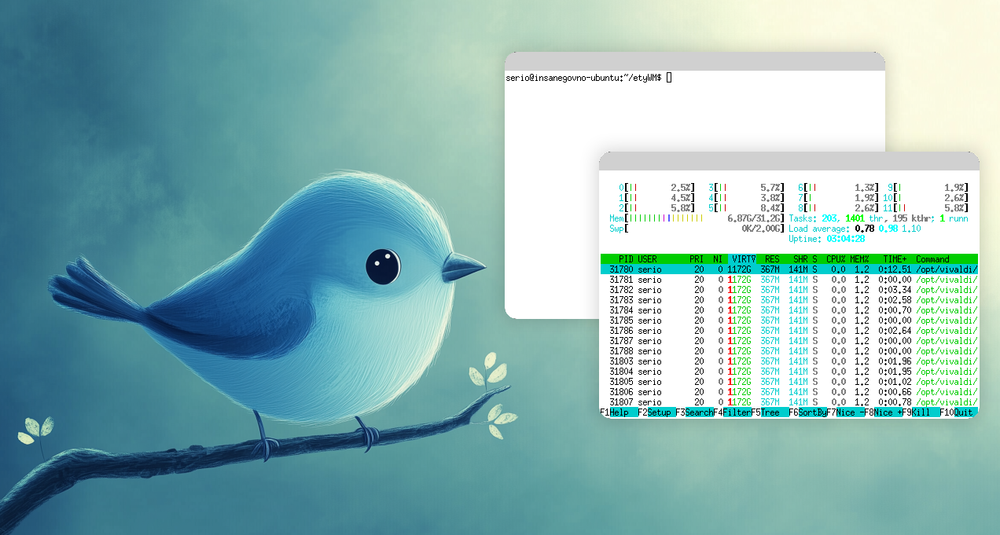

# etyWM

**etyWM** is a minimal, fully functional XCB-based window manager featuring a title bar with rounded corners, focus-raising, and full mouse resizing support. It intercepts map requests to create frames with title bars and extra borders for resizing, and it handles window configuration and destruction events seamlessly.



## Features

- **Custom Frames:**  
  - Intercepts map requests and creates frames with a title bar and extra resize borders.
  - Uses the X11 Shape extension and Cairo to apply a rounded rectangle shape to frames.

- **Window Management:**  
  - Double left-click on the title bar toggles fullscreen mode.
  - Right-click anywhere on the frame closes the window.
  - Drag windows by clicking and dragging the title bar.
  - Resize windows by clicking near any border (left, right, top, bottom, or corners).

- **Translucency Support:**  
  - The title bar is rendered with translucency (requires a compositing manager, e.g., **picom**).

- **Focus-Raising:**  
  - Automatically raises the focused window.

- **XCB & Cairo:**  
  - Built using the XCB library for X11 communication and Cairo for drawing.

## Prerequisites

Before compiling and running etyWM, ensure that you have the following libraries installed:

- **xcb** (and xcb-proto)
- **xcb-shape**
- **cairo**


Additionally, to enable translucency and other compositing effects, install a compositing manager such as [picom](https://github.com/yshui/picom).

## Compilation

Compile and run etyWM with the following command:

```bash
sh start.sh
```

## Running etyWM

1. **Launch a Compositor:**  
   Make sure you have a compositing manager running (e.g., picom).  
   The window manager automatically launches picom with a specified configuration (`/home/serio/.config/picom.conf`). Adjust the path if necessary.

2. **Set the Background:**  
   The window manager loads a PNG background from `/home/serio/etyWM/background_sm.png` and scales it to your screen size.  
   Ensure this file exists or update the path in the source code.

3. **Start etyWM:**  
   Execute the compiled binary:
   
   ```bash
   ./etyWM
   ```

4. **Test with xterm:**  
   The window manager also launches `xterm` by default. Make sure xterm is installed:
   
   ```bash
   sudo apt-get install xterm
   ```

## Usage

- **Move a Window:**  
  Left-click and drag the title bar of a window.

- **Resize a Window:**  
  Left-click near any border (or corner) of a window frame and drag to resize.  
  Windows have a minimum size of 100×50 pixels.

- **Toggle Fullscreen:**  
  Double left-click the title bar to toggle between fullscreen and windowed mode.

- **Close a Window:**  
  Right-click anywhere on the window frame.

## Customization

- **Appearance:**  
  Modify constants like `TITLE_BAR_HEIGHT`, `CORNER_RADIUS`, and `RESIZE_BORDER` in the source code to adjust the appearance of the window frames and title bar.

- **Background Image:**  
  Change the path to the background image in the source code if you wish to use a different wallpaper.

- **Compositor Config:**  
  Update the picom configuration path in the `launch_picom()` function if your configuration is stored elsewhere.

## Troubleshooting

- **Another Window Manager Running:**  
  If you see an error message stating that another window manager is running, ensure that no other window manager is active.

- **Compositing Issues:**  
  If translucency or shadow effects do not appear, verify that your compositing manager (picom) is running.
